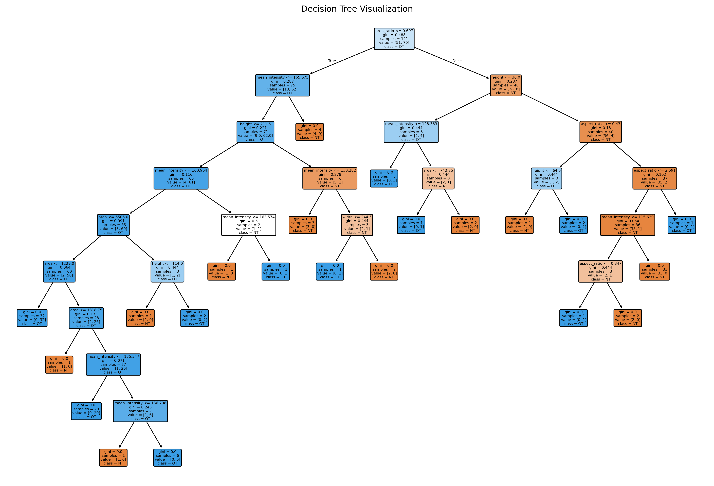
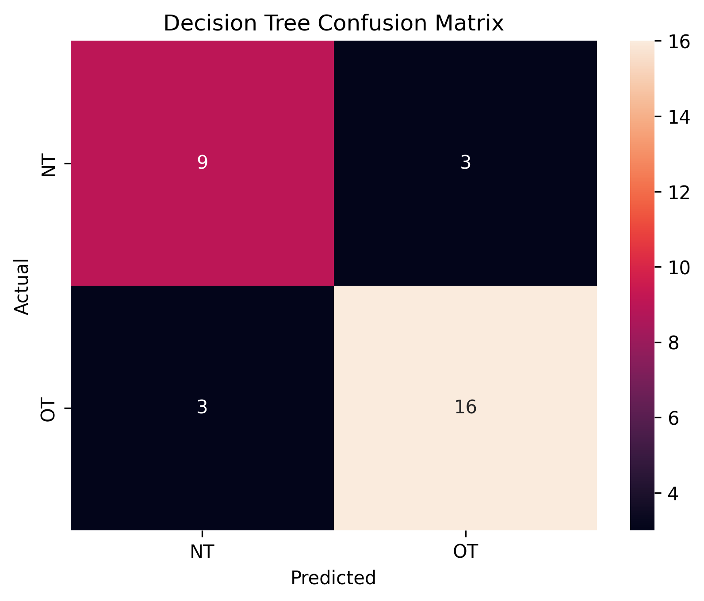
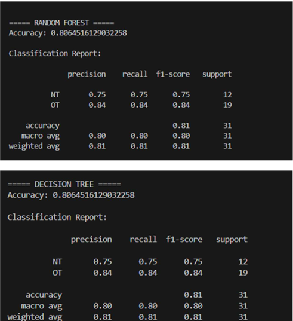
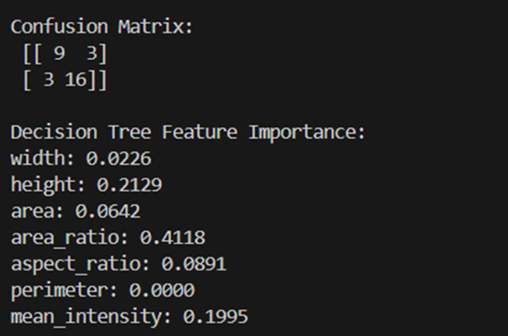
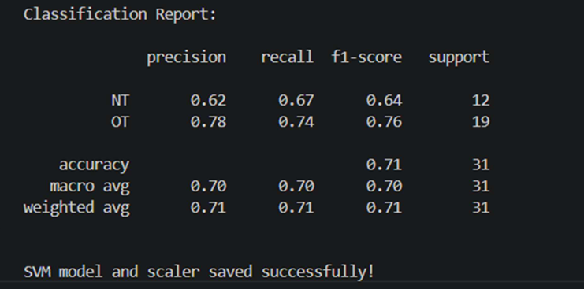
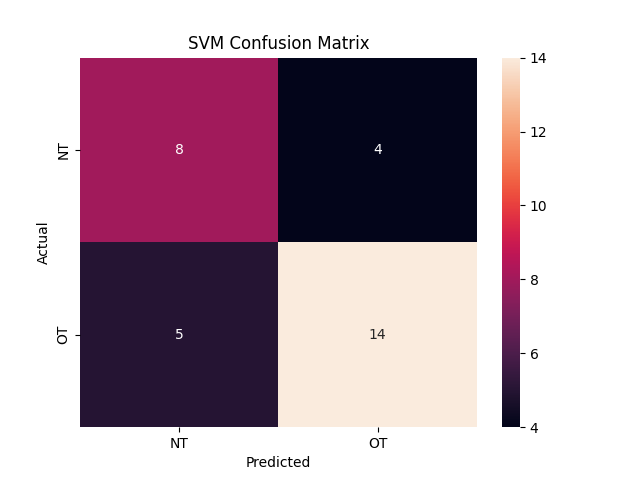
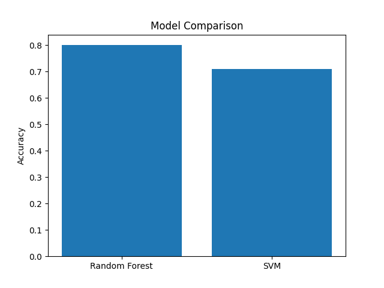
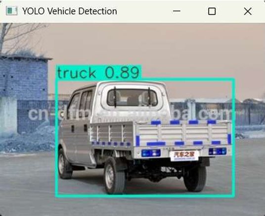
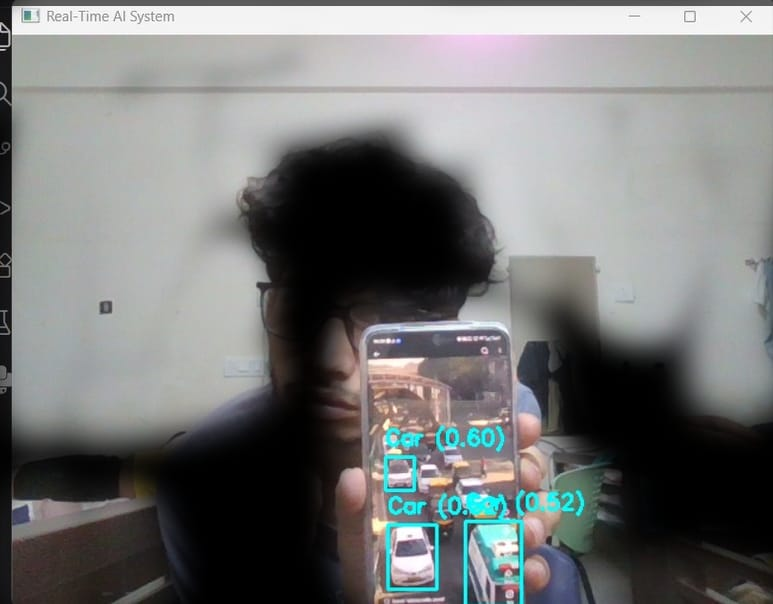
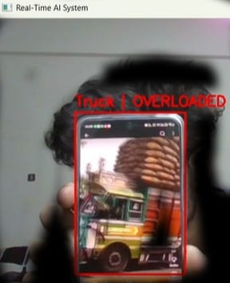

\# Real-Time Vehicle Threat Detection System

AI based real time vehicle detection and overloaded vehicle threat analysis system using YOLOv8, OpenCV, and Machine Learning.

\## Technologies Used

\- Python

\- OpenCV

\- YOLOv8

\- Scikit-learn

\- Random Forest

\- SVM

\- NumPy

\- Pandas

\## Model Performance

\- Random Forest Accuracy: 80%

\- SVM Accuracy: 70%

\## Project Pipeline

1\. Vehicle detection using YOLOv8

2\. Feature extraction

3\. Overload classification

4\. Real-time safety alert generation

## Screenshots

### Decision Tree

---

### Decision Tree Confusion Matrix

---

### Random Forest Results

---

### Random Forest Confusion Matrix

---

### Random Forest Decision Tree

---

### SVM Results

---

### SVM Confusion Matrix

---

### Model Comparison

---

### Detection Test

---

### Real Time Testing

---

### Overload Detection

---

## Contributors

- [Sidhant Katyayan](https://github.com/sidhantkatyayan-cloud)
- [Ruchithakommineni](https://github.com/Ruchithakommineni)
